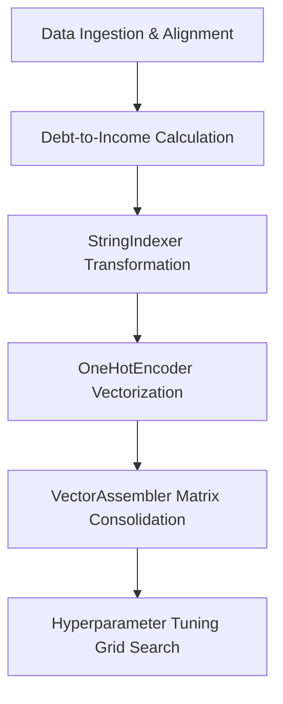

# MACHINE LEARNING PROJECT 1
# End-to-End Commercial Loan Risk Evaluation (PySpark ML Pipelines)

## Project Overview
This project demonstrates a production-grade, distributed machine learning pipeline built using Apache Spark (PySpark) to automate commercial credit risk assessment and loan approval workflows. The pipeline simulates real-world enterprise architectures by treating missing data imputation, dynamic financial feature engineering, categorical cross-encoding, and model inference as an atomic, unified workflow—preventing data leakage and ensuring seamless deployment readiness.

---

## The Problem & Solution Matrix

<table>
  <tr>
    <td><strong>The Problem</strong></td>
    <td><strong>The Solution</strong></td>
  </tr>
  <tr>
    <td>
      <ul>
        <li><strong>Feature Dominance Bias:</strong> Models often lean heavily on a single categorical indicator (like credit history), blinding predictions to continuous financial volume anomalies.</li>
        <li><strong>Ingress Schema Drift:</strong> Raw data streams frequently arrive in production from legacy systems with corrupted or truncated headers.</li>
        <li><strong>Deployment Fragility:</strong> Data cleaning parameters are maintained outside the core model artifact, resulting in high manual feature duplication errors.</li>
      </ul>
    </td>
    <td>
      <ul>
        <li><strong>Engineered Liquidity Layers:</strong> Builds a robust feature engineering layer to evaluate debt-to-income liquidity alongside categorical records.</li>
        <li><strong>Runtime Drift Resolution:</strong> Houses a dedicated batch inference simulation script capable of mapping and resolving column runtime drift automatically.</li>
        <li><strong>Atomic Serialization:</strong> Persists the entire trained transformation and inference engine natively to disk for zero-leakage deployment.</li>
      </ul>
    </td>
  </tr>
</table>

---

## Tech Stack & Architecture

* **Engine:** Apache Spark / PySpark (Spark SQL & Spark ML)
* **Optimization Framework:** TrainValidationSplit Cross-Evaluation Search Grid (Evaluating 36 distinct tuning combinations)
* **Core Classifier:** Tuned DecisionTreeClassifier Architecture
* **Environment:** Python / Jupyter Notebook Execution Layer

---

## Pipeline Architecture

# Spark ML Loan Approval Pipeline

An end-to-end distributed machine learning and data engineering pipeline designed for scalable loan approval prediction, automated feature engineering, and robust model serialization.

---

## 🛠️ Technical Stage Breakdown

1. **Data Alignment & Imputation**  
   Resolves real-time column name truncation mismatches and replaces null arrays with historic sample constraints.

2. **Dynamic Feature Engineering**  
   Computes a continuous capital leverage metric to prevent single-feature dominance:
   $$\text{DebtToIncomeRatio} = \frac{\text{LoanAmount} \times 1000}{\text{ApplicantIncome} + \text{CoapplicantIncome} + 1.0}$$

3. **StringIndexer**  
   Converts categorical text strings into optimized numerical indices.

4. **OneHotEncoder**  
   Transforms categorical index metrics into binary vectors to eliminate mathematical scaling bias.

5. **VectorAssembler**  
   Consolidates sparse binary vectors and continuous numerical metrics into a single high-dimensional feature matrix.

6. **Classifier Training Array**  
   Applies hyperparameter cross-tuning across tree depth limits and element node boundaries to identify the champion architecture configuration.

---

## 📊 Key Technical Achievements & Metrics

### Operational Stability Metric Tracking
The production model was rigorously audited using multiple evaluation metrics to ensure a reliable balance between predictive precision and operational stability.

| Metric | Value | Description |
| :--- | :--- | :--- |
| **Standardized Model Accuracy** | `78.35%` | Percentage of all loan applications in the hidden testing split correctly classified. |
| **Standardized Model Error Rate** | `21.65%` | Baseline misclassification variance tracking. |

> **🛡️ Risk Automation Guardrails:**  
> The hyperparameter-optimized model successfully identifies high-leverage debt anomalies, accurately denying high-risk applicants that hold perfect historic credit checks, while strictly upholding banking policies against long-term default profiles.

---

## 📦 Production Packaging

- **Atomic Serialization:**  
  The entire sequence of data cleaning configurations, vector assembly steps, and trained decision criteria is frozen together into a native `Spark PipelineModel` artifact.

- **MLOps Isolation Protocol:**  
  Production inference notebooks load the frozen artifact completely independent of training memory frameworks. The runtime pipeline cleans drifting legacy data sources, constructs the continuous financial ratio, and scores live transactions seamlessly using a single interface call.

---

## 🚀 Future Improvements

- [ ] Connect the pipeline framework into an automated containerized processing orchestration engine.
- [ ] Migrate target storage layouts onto distributed cloud object storage clusters backed by cloud data lakes.
- [ ] Integrate continuous model tracking layers to monitor parameter distribution shifts over time.

---

## 👤 Author

**Data Engineer / Analyst**  
*Building high-performance, scalable distributed systems and production data pipelines.*
